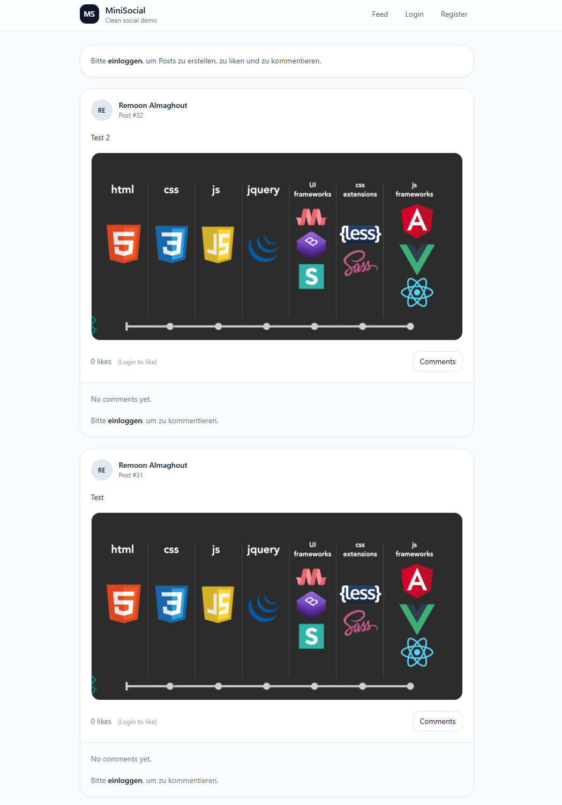
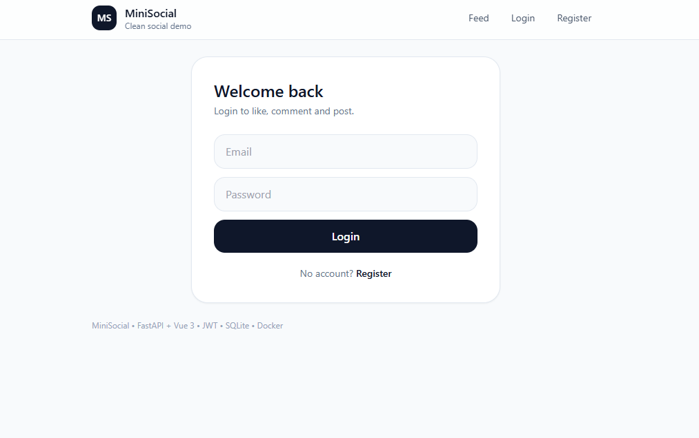
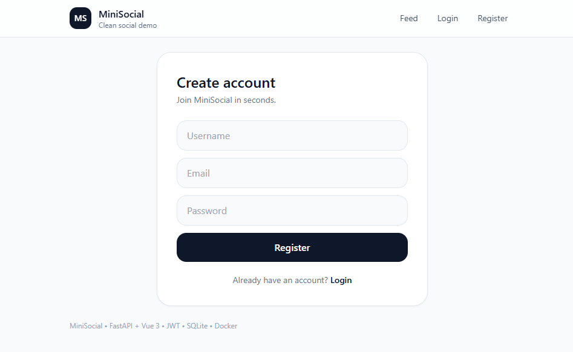
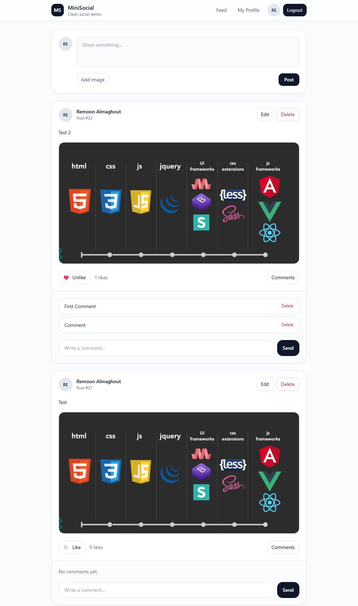
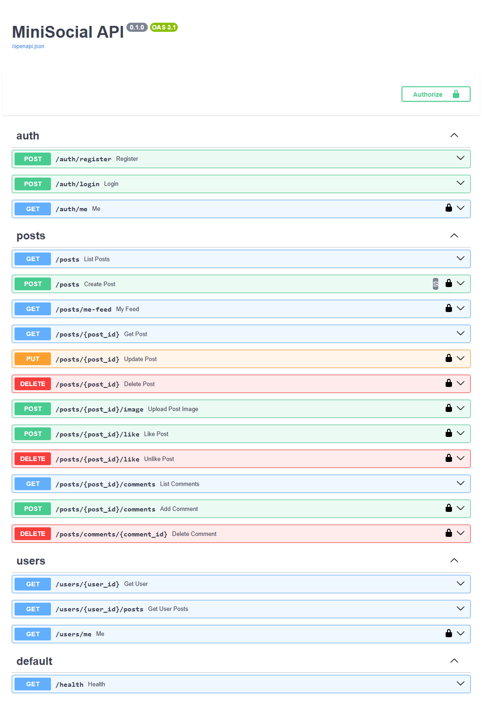
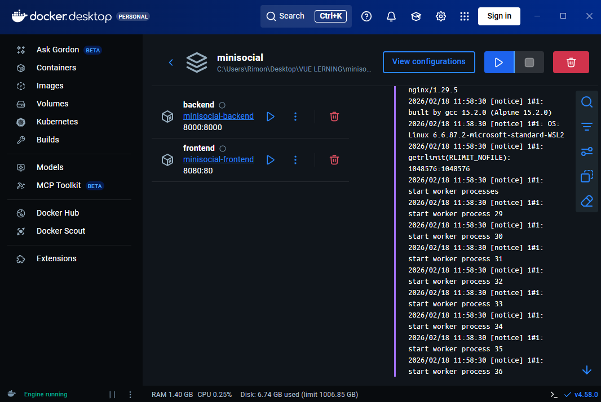

# \*\*MiniSocial is a small social media demo app with:

- FastAPI (Backend API)
- Auth (JWT)
- Posts CRUD (owner protected)
- Image upload with validation
- Likes + Comments
- SQLite + Alembic migrations
- Vue 3 + Tailwind
- E2E Testing with Playwright
- Docker Compose setup\*\*

## Feed Public



## Login



## Register


## Feed auth


## Profile


## Swaager


## Docker


MiniSocial ist eine moderne Full-Stack Social-Media-Webanwendung mit Benutzerregistrierung, Authentifizierung, Posts, Bild-Upload, Likes, Kommentaren und Profilseiten.

# 🚀 MiniSocial


MiniSocial ist eine moderne **Full-Stack Social Media Web Application**, entwickelt mit:

- ⚡ FastAPI (Backend API)
- 🎨 Vue 3 + TailwindCSS (Frontend)
- 🔐 JWT Authentication
- 🗄 SQLite + Alembic Migrationen
- 🐳 Docker Compose Setup
- 🧪 E2E Testing mit Playwright

Das Projekt demonstriert professionelle Architektur, saubere Trennung von Backend & Frontend sowie produktionsnahe Deployment-Strukturen.

---

# ✨ Features

## 🔐 Authentication

- Benutzerregistrierung
- Login
- JWT Access Token
- Protected API Endpoints
- Route Guards im Frontend
- `/auth/me` User Endpoint

---

## 📝 Posts

- Post erstellen
- Post bearbeiten (Owner only)
- Post löschen (Owner only)
- Bild-Upload mit Validierung
- Pagination im Feed
- Public Feed (Read-only)

---

## ❤️ Likes

- Like / Unlike
- Live Like Count
- `liked_by_me` Flag
- Protected Actions

---

## 💬 Comments

- Kommentar hinzufügen
- Kommentar löschen (Owner)
- Kommentar-Anzahl
- Kommentar-Preview im Profil

---

## 👤 Profile Page

- Benutzerprofil
- Initialen-Avatar
- Statistiken:
  - Anzahl Posts
  - Erhaltene Likes
  - Erhaltene Kommentare
- Eigene Posts verwalten

---

## 🎨 UI

- Modernes TailwindCSS Design
- Card Layout
- Toast Notifications
- Confirm Modal
- Responsive Layout

---

# 🛠 Tech Stack

## Backend

- FastAPI
- SQLAlchemy ORM
- Alembic Migrationen
- SQLite
- Pydantic
- JWT (HS256)
- Uvicorn

## Frontend

- Vue 3 (Composition API)
- Vue Router
- Axios
- TailwindCSS
- Custom Toast System
- Nginx (Production)

## Testing

- Playwright E2E Tests
- Auth Flow Tests
- CRUD Tests
- Likes & Comments Tests

## DevOps

- Docker
- Docker Compose
- Multi-Stage Build
- Production-ready Setup

---

# 📦 Projektstruktur

```
minisocial/
├── backend/
│ ├── alembic/
│ ├── alembic.ini
│ ├── app/
│ │ ├── api/
│ │ ├── core/
│ │ ├── db/
│ │ ├── schemas/
│ │ └── main.py
│ ├── data/ # SQLite DB / Persistenz (je nach Setup)
│ ├── uploads/ # hochgeladene Bilder (File-Upload)
│ ├── Dockerfile
│ └── requirements.txt
│
├── frontend/
│ ├── src/
│ │ ├── api/
│ │ ├── components/
│ │ ├── router/
│ │ ├── ui/
│ │ ├── views/
│ │ ├── App.vue
│ │ ├── auth.js
│ │ └── main.js
│ ├── tests/ # Playwright E2E Tests
│ ├── playwright.config.js
│ ├── nginx.conf
│ ├── Dockerfile
│ └── package.json
│
├── docs/
│ └── screenshots/ # Screenshots für README
│
├── docker-compose.yml
└── README.md
```

---

# 🐳 Run with Docker

## Voraussetzungen

- Docker
- Docker Compose

---

## Starten

```bash
docker compose up --build
```

Frontend:

```
http://localhost:8080
```

Backend:

```
http://localhost:8000
```

Swagger Docs:

```
http://localhost:8000/docs
```

---

# 🧪 Tests

E2E Tests ausführen:

```bash
cd frontend
npm run test:e2e
```

Getestet wird:

- Routing
- Register
- Login

---

# 🔐 API Endpoints

## Auth

```
POST /auth/register
POST /auth/login
GET  /auth/me
```

## Posts

```
GET    /posts
GET    /posts/me-feed
POST   /posts
PUT    /posts/{id}
DELETE /posts/{id}
```

## Likes

```
POST   /posts/{id}/like
DELETE /posts/{id}/like
```

## Comments

```
GET    /posts/{id}/comments
POST   /posts/{id}/comments
DELETE /posts/comments/{id}
```

## Users

```
GET /users/{id}
GET /users/{id}/posts
```

---

# 🎯 Architektur Highlights

- Saubere REST Struktur
- Owner-based Access Control
- Stateless JWT Authentication
- Pagination Support
- File Upload Handling
- Migration-basierte Datenbankverwaltung
- Docker Production Build
- E2E Testing

---

# 📜 Lizenz

MIT License
