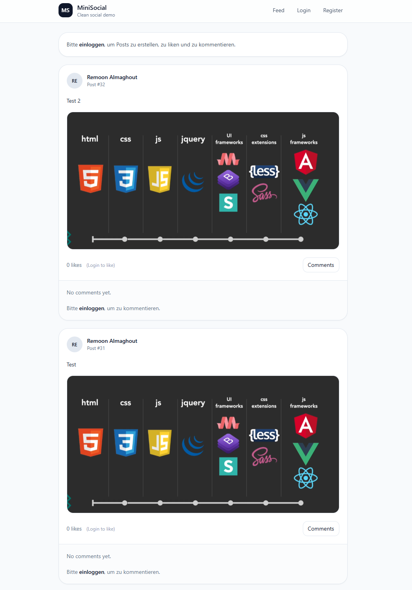
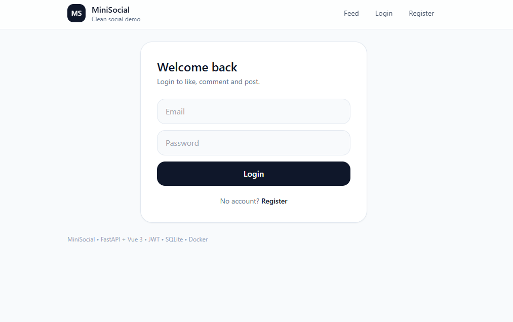
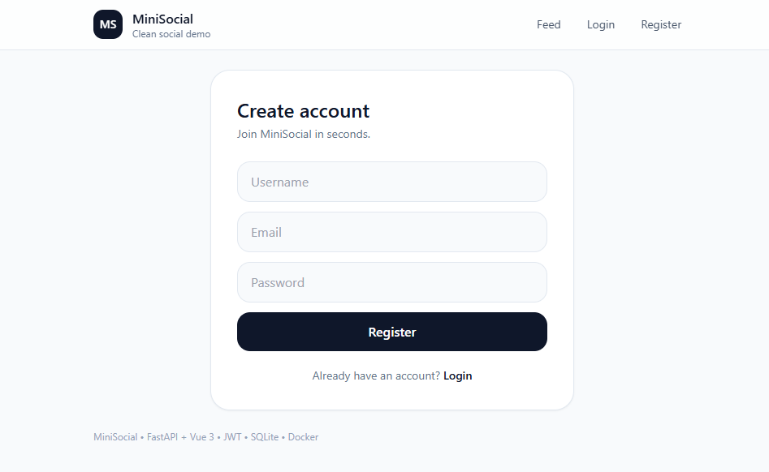
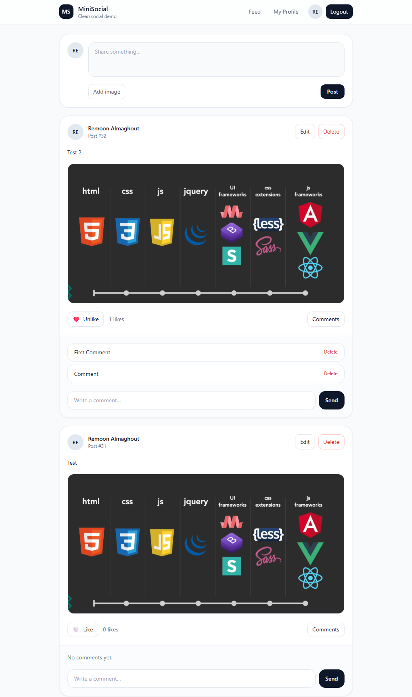
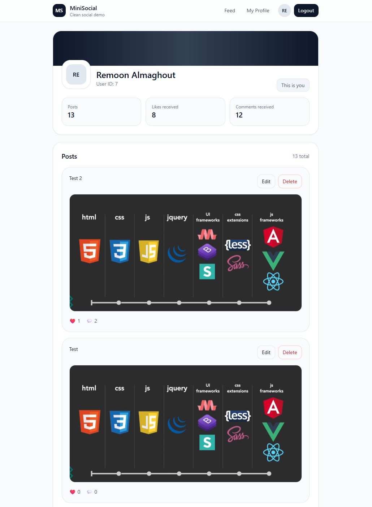
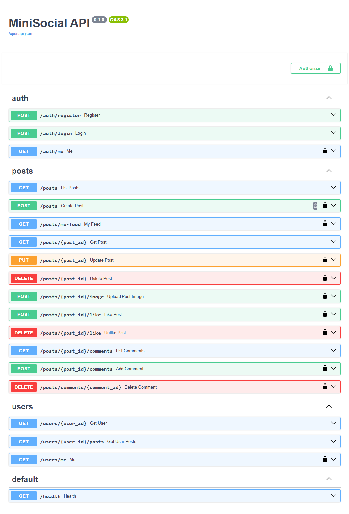
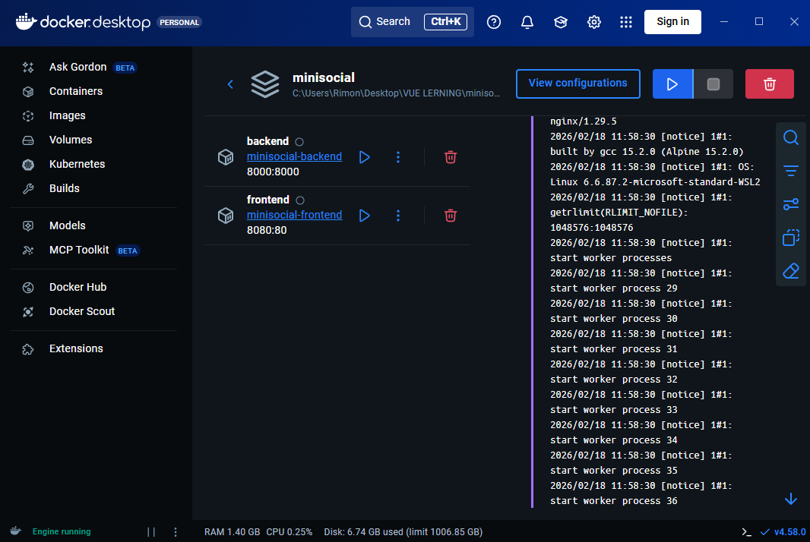

## MiniSocial is a modern **Full-Stack Social Media Web Application**, built with:


- ⚡ FastAPI (Backend API)
- 🎨 Vue 3 + TailwindCSS (Frontend)
- 🔐 JWT Authentication
- 🗄 SQLite + Alembic Migrations
- 🐳 Docker Compose Setup
- 🧪 E2E Testing with Playwright

This project demonstrates professional architecture, clean separation of backend and frontend, and production-ready deployment structures.

---

# ✨ Features

## 🔐 Authentication

- User registration
- Login
- JWT access token
- Protected API endpoints
- Frontend route guards
- `/auth/me` user endpoint

---

## 📝 Posts

- Create posts
- Edit posts (owner only)
- Delete posts (owner only)
- Image upload with validation
- Feed pagination
- Public feed (read-only)

---

## ❤️ Likes

- Like / Unlike posts
- Live like count
- `liked_by_me` flag
- Protected actions

---

## 💬 Comments

- Add comments
- Delete comments (owner only)
- Comment count
- Comment preview on profile

---

## 👤 Profile Page

- User profile
- Initials avatar
- Statistics:
  - Number of posts
  - Received likes
  - Received comments
- Manage own posts

---

## 🎨 UI

- Modern TailwindCSS design
- Card layout
- Toast notifications
- Confirmation modal
- Responsive layout

---

# 🛠 Tech Stack

## Backend

- FastAPI
- SQLAlchemy ORM
- Alembic Migrations
- SQLite
- Pydantic
- JWT (HS256)
- Uvicorn

## Frontend

- Vue 3 (Composition API)
- Vue Router
- Axios
- TailwindCSS
- Custom toast system
- Nginx (Production)

## Testing

- Playwright E2E tests
- Authentication flow tests
- CRUD tests
- Likes & comments tests

## DevOps

- Docker
- Docker Compose
- Multi-stage build
- Production-ready setup

---

# 📦 Project Structure

```
minisocial/
├── backend/
│   ├── alembic/
│   ├── alembic.ini
│   ├── app/
│   │   ├── api/
│   │   ├── core/
│   │   ├── db/
│   │   ├── schemas/
│   │   └── main.py
│   ├── data/
│   ├── uploads/
│   ├── Dockerfile
│   └── requirements.txt
│
├── frontend/
│   ├── src/
│   │   ├── api/
│   │   ├── components/
│   │   ├── composables/
│   │   ├── router/
│   │   ├── services/
│   │   ├── ui/
│   │   ├── utils/
│   │   ├── views/
│   │   ├── App.vue
│   │   ├── main.js
│   │   └── style.css
│   ├── tests/e2e/
│   │   ├── api/
│   │   ├── helpers/
│   │   ├── pages/
│   │   └── specs/
│   ├── playwright.config.js
│   ├── nginx.conf
│   ├── Dockerfile
│   └── package.json
│
├── docs/
│   └── screenshots/ # Screenshots für README
│
├── docker-compose.yml
└── README.md
```

---

## 🌍 Live Demo

Frontend: https://containerized-minisocial-fastapi-vu.vercel.app  
Backend (Swagger): https://minisocial-backend-n4ut.onrender.com/docs

> Note: The live demo uses free hosting. SQLite data and uploads may reset after redeploy or restart.

---

## 🐳 Run with Docker

### Requirements

- Docker
- Docker Compose

### Start

```bash
docker compose up --build
```

> Database migrations run automatically when the backend container starts.

### URLs

- Frontend: `http://localhost:8080`
- Backend: `http://localhost:8000`
- Swagger: `http://localhost:8000/docs`

---

## 🧪 Tests

### Requirements (one-time setup)

```bash
cd frontend
npm install
npm i -D @playwright/test cross-env
npx playwright install
```

### Run Tests

#### 1) Start Docker (project root)

```bash
docker compose up --build
```

#### 2) E2E (UI) Tests (`frontend/`)

```bash
cd frontend
npm run test:e2e
```

#### 3) API Tests (`frontend/`)

```bash
cd frontend
npm run test:api
```

### What is tested?

#### ✅ E2E (UI)

- Routing
- Register
- Login
- Create posts
- Add & delete comments
- Open profile page

#### ✅ API

- Auth: `register → login → /auth/me`
- Posts: `create → list → update → delete`

---

# 🔐 API Endpoints

## Auth

```
POST /auth/register
POST /auth/login
GET  /auth/me
```

## Posts

```
GET    /posts
GET    /posts/me-feed
POST   /posts
PUT    /posts/{id}
DELETE /posts/{id}
```

## Likes

```
POST   /posts/{id}/like
DELETE /posts/{id}/like
```

## Comments

```
GET    /posts/{id}/comments
POST   /posts/{id}/comments
DELETE /posts/comments/{id}
```

## Users

```
GET /users/{id}
GET /users/{id}/posts
```

---

# 🎯 Architektur Highlights

- Clean REST structure
- Owner-based access control
- Stateless JWT authentication
- Pagination Support
- File Upload Handling
- Migration-based database management
- Docker Production Build
- E2E Testing

---

## Feed Public



## Login



## Register



## Feed auth



## Profile



## Swagger



## Docker

## 
